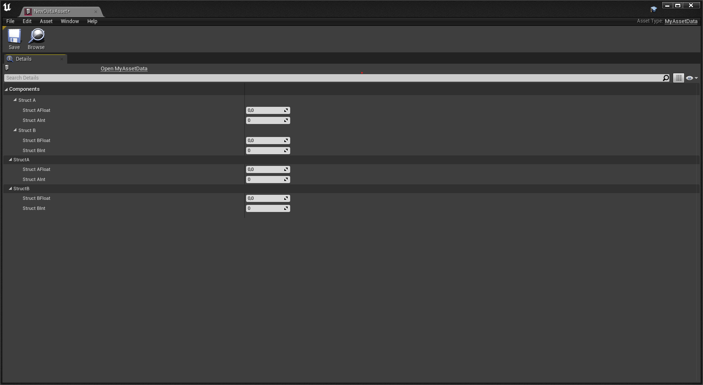

# UE4 property duplication when favorites are activated

## Issue

When `Enable Details Panel Favorites` is set in editor preferences, properties are duplicated in Details panel :



## Proposed solution

`UE4\Engine\Source\Editor\PropertyEditor\Private\DetailLayoutHelpers.cpp@251` :
```cpp
if (bRecurseIntoChildren || LocalUpdateFavoriteSystemOnly)
{
    // If we are looking to update only favorites, pass this restriction to the child
    if (LocalUpdateFavoriteSystemOnly && LocalUpdateFavoriteSystemOnly)
    {
        ChildArgs.bUpdateFavoriteSystemOnly = LocalUpdateFavoriteSystemOnly;
    }
    
    // Built in struct properties or children of arras 
    UpdateSinglePropertyMapRecursive(ChildNode, CurCategory, CurObjectNode, ChildArgs);
}
```
